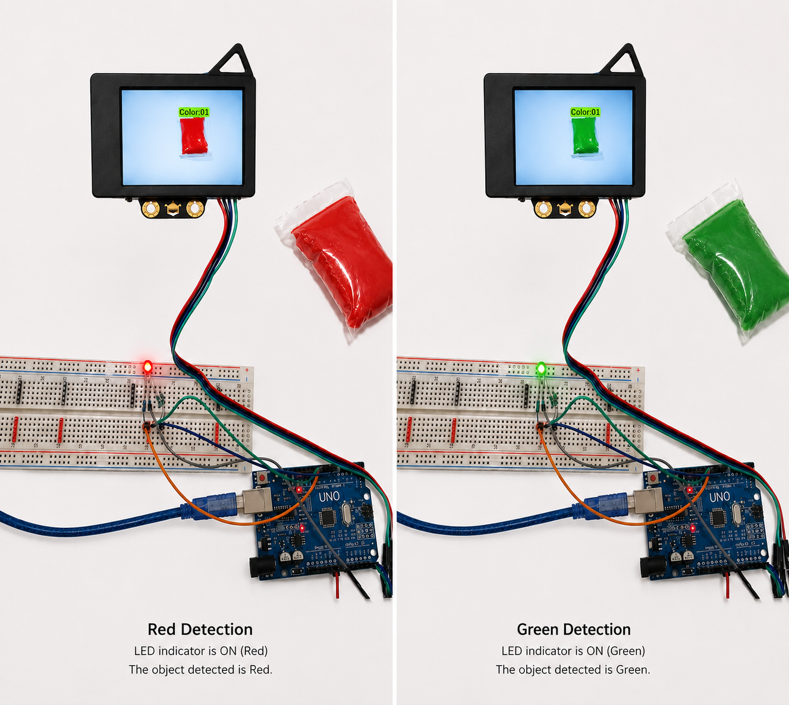

# 🎨 Arduino HuskyLens Color Detection

A real-time color detection system built using **Arduino Uno**, **HuskyLens AI Camera**, and an **RGB LED**.

The HuskyLens camera recognizes trained colors using the **Color Recognition** algorithm and sends the detected color ID to the Arduino via the **I2C protocol**. Based on the detected ID, the Arduino lights the corresponding RGB LED.

---

## 📖 Table of Contents

- Project Overview
- Hardware Components
- Software Requirements
- Wiring
- Project Structure
- How It Works
- Code Explanation
- Project Images
- Results
- Future Improvements

---

# 📌 Project Overview

This project demonstrates AI-based color recognition using the HuskyLens camera.

The system was trained to recognize three colors:

- 🔵 Blue
- 🟢 Green
- 🔴 Red

When a trained color is detected, the RGB LED lights with the matching color.

---

# 🛠 Hardware Components

- Arduino Uno
- HuskyLens AI Camera
- RGB LED (Common Anode)
- Breadboard
- Jumper Wires
- 220Ω Resistors
- USB Cable

---

# 💻 Software Requirements

- Arduino IDE
- HuskyLens Library
- Wire Library

---

# 🔌 Wiring

### HuskyLens → Arduino

| HuskyLens | Arduino |
|-----------|----------|
| VCC | 5V |
| GND | GND |
| SDA | SDA |
| SCL | SCL |

### RGB LED

| LED Color | Arduino Pin |
|-----------|-------------|
| Red | D10 |
| Green | D9 |
| Blue | D11 |

---

# 📁 Project Structure

```text
Arduino-HuskyLens-Color-Detection/
│
├── README.md
├── Color_Detection.ino
├── blue-detection.png
└── color-detection-red-green-demo.png
```

---

# ⚙️ How It Works

1. Connect HuskyLens to Arduino using the I2C interface.
2. Upload the Arduino program.
3. Open the HuskyLens menu.
4. Select **Color Recognition**.
5. Train the desired colors.
6. Present a trained color to the camera.
7. HuskyLens sends the detected color ID.
8. Arduino turns on the corresponding RGB LED.

---

# 💻 Code Explanation

The Arduino program performs the following tasks:

- Initializes the HuskyLens camera.
- Starts I2C communication.
- Selects the **Color Recognition** algorithm.
- Reads the detected color ID.
- Controls the RGB LED based on the detected color.

### Color IDs

| ID | LED |
|----|-----|
| 1 | 🔵 Blue |
| 2 | 🟢 Green |
| 3 | 🔴 Red |

If no trained object is detected, all LEDs remain OFF.

---

# 📷 Project Images

## Blue Color Detection


---

## Color Detection Results



---

# ✅ Results

- Successfully detected trained colors.
- Correct RGB LED activated for each detected color.
- Reliable communication between Arduino and HuskyLens using I2C.
- Real-time color recognition.

---

# 🚀 Future Improvements

- Detect additional colors.
- Display the detected color name on an OLED display.
- Add a buzzer for audio feedback.
- Control external devices based on the detected color.

---

# 👩‍💻 Author

**Ebtihal**

Computer and Network Engineering Student

University of Jeddah
